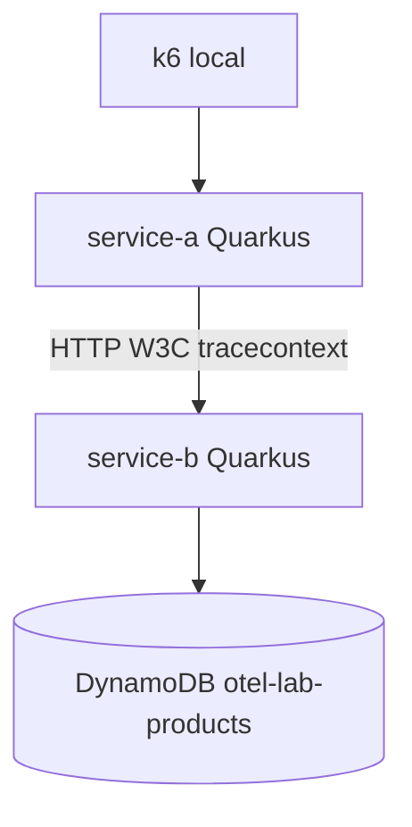
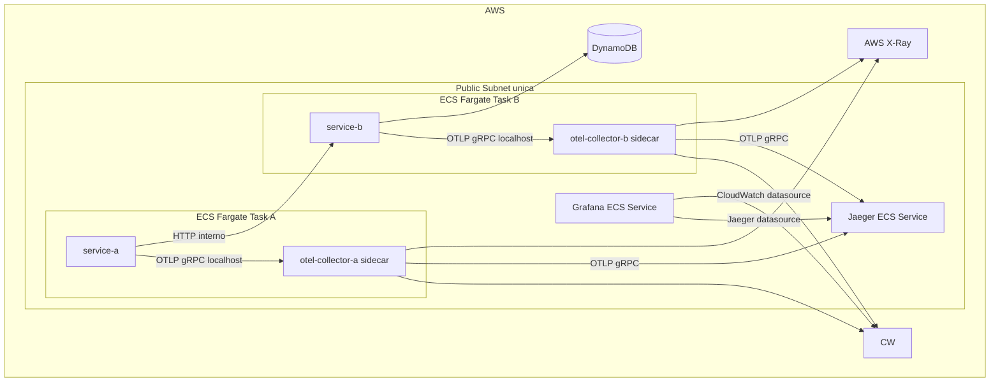

# Unidad 2 Actividad 2 - OpenTelemetry Microservices Lab

Laboratorio academico de observabilidad distribuida con dos microservicios Quarkus instrumentados con OpenTelemetry y desplegados en AWS ECS Fargate.

La arquitectura implementa el flujo `service-a -> service-b -> DynamoDB`, con trazas distribuidas, logs JSON correlacionados por `trace_id`, metricas, dashboard Grafana, Jaeger, AWS X-Ray y benchmark de overhead con k6.

## Arquitectura



Diagrama editable:

- [docs/architecture.drawio](docs/architecture.drawio)

## Arquitectura AWS



Se evita NAT Gateway, ALB, RDS, EKS, Managed Prometheus y Managed Grafana para reducir costo. `service-a`, Grafana y Jaeger se expusieron directamente con public IP de Fargate. `service-b` no se expone publicamente y se resuelve mediante Cloud Map privado.

## Observabilidad

- HTTP inbound: instrumentacion automatica de Quarkus REST.
- HTTP outbound: instrumentacion automatica de Quarkus REST Client.
- DynamoDB: instrumentacion AWS SDK via Quarkus Amazon Services con `quarkus.dynamodb.telemetry.enabled=true`.
- Custom spans: `process-order` y `lookup-product`.
- Context propagation: W3C Trace Context entre `service-a` y `service-b`.
- Logs: JSON en stdout con `service`, `trace_id` y `span_id`; en AWS tambien quedan en CloudWatch Logs.
- Traces AWS: aplicacion -> sidecar Collector -> AWS X-Ray y Jaeger.
- Logs OTLP AWS: Collector -> CloudWatch Logs mediante `awscloudwatchlogs`.
- Metrics local: Collector Prometheus exporter + Prometheus/Grafana OSS locales.
- Metrics AWS: CloudWatch `AWS/ECS` + Grafana CloudWatch datasource.

## Endpoints

Local Docker Compose:

- service-a: http://localhost:8080/orders/order-1
- service-b: http://localhost:8081/products/product-1
- Jaeger: http://localhost:16686
- Prometheus: http://localhost:9090
- Grafana: http://localhost:3000

AWS ECS Fargate:

- service-a: http://54.211.65.191:8080
- Grafana: http://3.90.145.54:3000
- Jaeger: http://3.89.48.195:16686

Nota: las IP publicas de Fargate son efimeras y pueden cambiar si se recrean las tasks. Resolverlas con:

```bash
make service-a-url
make grafana-url
make jaeger-url
```

## Local

```bash
docker compose up --build
curl http://localhost:8080/orders/order-1
docker compose --profile benchmark run --rm k6 run /scripts/load-test.js
```

## Terraform

Configurar variables:

```bash
cp infra/terraform.tfvars.example infra/terraform.tfvars
```

Editar `infra/terraform.tfvars` con el email real. No versionar ese archivo.

Validar y planear:

```bash
make plan
```

Desplegar solo cuando sea explicito:

```bash
make deploy
```

Resolver URL publica efimera de `service-a`:

```bash
make service-a-url
```

Destruir:

```bash
make destroy
make verify-cleanup
```

## Benchmark y Overhead

Baseline local sin OTel:

```bash
make benchmark-baseline
```

Con OTel:

```bash
make benchmark-otel
```

Ejecucion comparativa completa:

```bash
make benchmark-overhead
```

Resultados finales documentados:

| Metric | Without OTel | With OTel | Observed overhead |
| --- | ---: | ---: | ---: |
| Average latency | 32.73 ms | 70.30 ms | +114.78% |
| p95 latency | 65.30 ms | 166.61 ms | +155.15% |
| p99 latency | 96.92 ms | 508.31 ms | +424.47% |
| Throughput | 8.133 req/s | 7.862 req/s | -3.33% |
| Error rate | 0.06% | 0.00% | -0.06 pp |

Evidencia:

- [docs/BENCHMARK.md](docs/BENCHMARK.md)
- [docs/evidence/benchmark-without-otel-20260815-224421.log](docs/evidence/benchmark-without-otel-20260815-224421.log)
- [docs/evidence/benchmark-with-otel-20260815-224421.log](docs/evidence/benchmark-with-otel-20260815-224421.log)

## Budget

Terraform crea `otel-lab-budget` por USD 5/mes con alertas:

- 50% actual
- 80% actual
- 100% actual
- 100% forecasted

AWS Budget no es un hard cap. AWS no detiene automaticamente ECS al llegar a USD 5. La proteccion real del laboratorio es la combinacion de budget, alertas, recursos minimos, ausencia de NAT/ALB/RDS/EKS y `terraform destroy`.

## Evidencias

Entregables principales:

- Codigo instrumentado: [service-a](service-a), [service-b](service-b)
- Configuracion OTel Collector: [otel/collector-aws.yaml](otel/collector-aws.yaml), [otel/collector-local.yaml](otel/collector-local.yaml)
- Infraestructura Terraform: [infra](infra)
- Dashboard Grafana AWS: [grafana-aws/dashboards/otel-aws-lab.json](grafana-aws/dashboards/otel-aws-lab.json)
- Diagrama Draw.io: [docs/architecture.drawio](docs/architecture.drawio)
- Reporte tecnico Markdown: [docs/REPORT.md](docs/REPORT.md)
- Reporte tecnico PDF: [docs/REPORT.pdf](docs/REPORT.pdf)
- Evidencias: [docs/EVIDENCE.md](docs/EVIDENCE.md), [docs/evidence](docs/evidence), [docs/screenshots](docs/screenshots)
