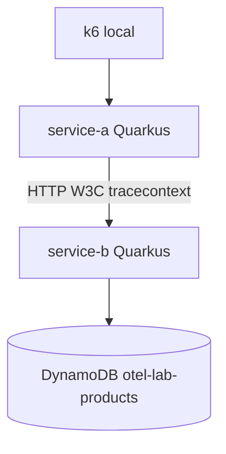
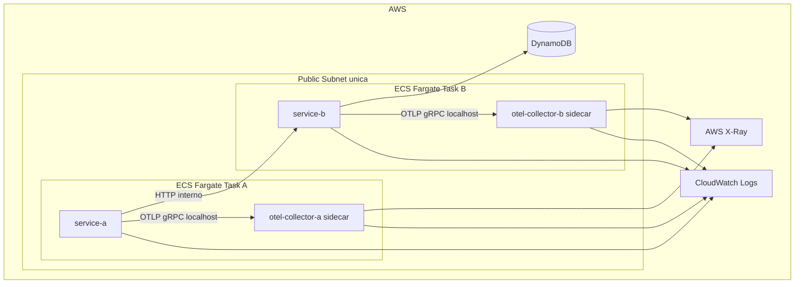

# OTel Microservices Lab

Laboratorio academico de observabilidad distribuida con Quarkus, OpenTelemetry, ECS Fargate, DynamoDB, AWS X-Ray, Prometheus, Grafana y k6.

## Arquitectura



## Arquitectura AWS



Se evita NAT Gateway, ALB, RDS, EKS, Managed Prometheus y Managed Grafana para reducir costo. `service-a` se expone directamente con public IP de Fargate; `service-b` no se expone publicamente y se resuelve mediante Cloud Map privado como excepcion tecnica minima para conectar dos ECS Services sin balanceador.

## Observabilidad

- HTTP inbound: instrumentacion automatica de Quarkus REST.
- HTTP outbound: instrumentacion automatica de Quarkus REST Client.
- DynamoDB: instrumentacion AWS SDK via Quarkus Amazon Services con `quarkus.dynamodb.telemetry.enabled=true`.
- Custom spans: `process-order` y `lookup-product`.
- Context propagation: W3C Trace Context entre `service-a` y `service-b`.
- Logs: JSON en stdout con `service`, `trace_id` y `span_id`; en AWS tambien quedan en CloudWatch Logs.
- Traces AWS: aplicacion -> sidecar Collector -> AWS X-Ray.
- Logs OTLP AWS: Collector -> CloudWatch Logs mediante `awscloudwatchlogs`.
- Metrics local: Collector Prometheus exporter + Prometheus/Grafana OSS locales.

## Local

```bash
docker compose up --build
curl http://localhost:8080/orders/order-1
docker compose --profile benchmark run --rm k6 run /scripts/load-test.js
```

URLs locales:

- service-a: http://localhost:8080/orders/order-1
- service-b: http://localhost:8081/products/product-1
- Jaeger: http://localhost:16686
- Prometheus: http://localhost:9090
- Grafana: http://localhost:3000

## Terraform

Configurar variables:

```bash
cp infra/terraform.tfvars.example infra/terraform.tfvars
```

Editar `infra/terraform.tfvars` con el email real. No versionar ese archivo.

Validar y planear:

```bash
make plan
```

Desplegar solo cuando sea explicito:

```bash
make deploy
```

Resolver URL publica efimera de `service-a`:

```bash
make service-a-url
```

Destruir:

```bash
make destroy
make verify-cleanup
```

## Benchmark

Baseline local sin OTel:

```bash
make benchmark-baseline
```

Con OTel:

```bash
make benchmark-otel
```

No inventar resultados. Completar `docs/BENCHMARK.md` despues de ejecutar k6 y tomar CPU/memoria desde ECS/CloudWatch.

## Budget

Terraform crea `otel-lab-budget` por USD 5/mes con alertas:

- 50% actual
- 80% actual
- 100% actual
- 100% forecasted

AWS Budget no es un hard cap. AWS no detiene automaticamente ECS al llegar a USD 5. La proteccion real del laboratorio es la combinacion de budget, alertas, recursos minimos, ausencia de NAT/ALB/RDS/EKS y `terraform destroy`.

## Evidencias

Usar `docs/EVIDENCE.md` como checklist. Las capturas se guardan en `docs/screenshots/`.
