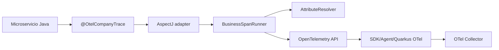

# Company OTel Business Instrumentation

Libreria reutilizable para crear spans de negocio con OpenTelemetry en aplicaciones Java sin acoplar la logica de dominio al SDK, exporters o al framework web.

## Objetivo

Centralizar la instrumentacion custom que normalmente se repite en servicios: crear spans, asignar atributos de negocio, registrar excepciones y mantener el codigo de negocio libre de llamadas directas a `Span.current()`.

## Modulos

| Modulo | Responsabilidad |
| --- | --- |
| `company-otel-core` | Anotacion, configuracion, resolucion de atributos y ejecucion de spans usando solo OpenTelemetry API. |
| `company-otel-jboss-mdc` | Adaptador opcional para publicar `trace_id` y `span_id` en JBoss MDC durante requests y spans de negocio. |
| `company-otel-aspectj` | Adaptador AOP con AspectJ para interceptar metodos anotados sin depender de Quarkus, Spring o Jakarta CDI. |

## Diseno



El core no configura exporters ni sampling. Esa responsabilidad queda en la aplicacion host, por ejemplo Quarkus OpenTelemetry o el Java agent.

## Uso

Anotar el metodo de negocio:

```java
@OtelCompanyTrace(operation = "otel.company.order.process")
public OrderResponse processOrder(String orderId) {
    return ...
}
```

Configurar atributos en `company-otel.properties`:

```properties
otel.company.order.process.span.name=process order
otel.company.order.process.attr.company.order.id=#orderId
otel.company.order.process.attr.company.order.status=#result.status
otel.company.order.process.attr.company.product.id=#result.product.productId
```

## Expresiones

| Expresion | Significado |
| --- | --- |
| `#orderId` | Argumento del metodo. |
| `#result.status` | Propiedad del resultado. |
| `#exception.message` | Propiedad de la excepcion. |
| `#baggage.tenant_id` | Valor de OpenTelemetry Baggage. |
| `literal` | Valor fijo. |

Soporta records, getters JavaBean, mapas y `Optional`.

## Configuracion Global

```properties
company.otel.max-attribute-length=256
company.otel.redacted-fields=password,secret,token,authorization,cvv,pan,creditCard,accessToken,refreshToken
```

Campos sensibles se reemplazan por `[REDACTED]`. La redaccion aplica por tokens exactos para evitar falsos positivos en nombres como `company`.

## Configuracion Por Operacion

```properties
otel.company.product.lookup.enabled=true
otel.company.product.lookup.span.name=lookup product
otel.company.product.lookup.record.exceptions=true
otel.company.product.lookup.capture.result=true
otel.company.product.lookup.attr.company.product.id=#productId
otel.company.product.lookup.attr.company.product.found=#result.present
```

Si `enabled=false`, el metodo se ejecuta sin crear span.

## Integracion Con Quarkus

Cada servicio agrega `company-otel-aspectj` como dependencia y usa `aspectj-maven-plugin` en `process-classes`. El build valida el weaving con mensajes como:

```text
Join point 'method-execution(...OrderService.processOrder...)' advised by OtelCompanyTraceAspect
```

El pointcut intercepta solo `method-execution` para evitar spans duplicados por llamadas internas.

## Relacion Con Auto-Instrumentation

Esta libreria no reemplaza la auto-instrumentacion HTTP/DB. La complementa:

- Quarkus OTel crea spans HTTP inbound/outbound y DynamoDB.
- Esta libreria crea spans de negocio como `process order` y `lookup product`.
- Todos comparten el mismo contexto de traza porque usan `GlobalOpenTelemetry`.

## Correlacion De Logs

El modulo `company-otel-jboss-mdc` mueve la responsabilidad de `trace_id` y `span_id` fuera de los microservicios. El aspect usa `OtelJbossMdc.BINDER` para poblar el MDC mientras se ejecuta un span de negocio, y tambien envuelve metodos JAX-RS (`@GET`, `@POST`, etc.) para cubrir logs del borde HTTP sin crear spans adicionales.

Con esto, los servicios no necesitan clases locales tipo `TraceMdc` ni llamadas manuales a `MDC.put(...)`.

## Limitaciones

- Requiere weaving AspectJ en build time si se usa el adaptador `company-otel-aspectj`.
- No exporta telemetria por si sola.
- No intenta instrumentar todos los metodos automaticamente; se limita a metodos anotados.
- La resolucion de atributos es intencionalmente simple para reducir riesgo y dependencia de lenguajes de expresion externos.

## Pruebas

Ejecutar:

```bash
mvn -f libs/company-otel-business/pom.xml -B -Dmaven.repo.local=.m2/repository test
```

Las pruebas cubren:

- creacion de spans con OpenTelemetry SDK en memoria,
- atributos desde argumentos y resultados,
- excepciones y status `ERROR`,
- operaciones deshabilitadas,
- resolucion de propiedades y redaccion.

## Build Local

```bash
mvn -f libs/company-otel-business/pom.xml -B -Dmaven.repo.local=.m2/repository install
mvn -f service-a/pom.xml -B -Dmaven.repo.local=.m2/repository -DskipTests package
mvn -f service-b/pom.xml -B -Dmaven.repo.local=.m2/repository -DskipTests package
```
